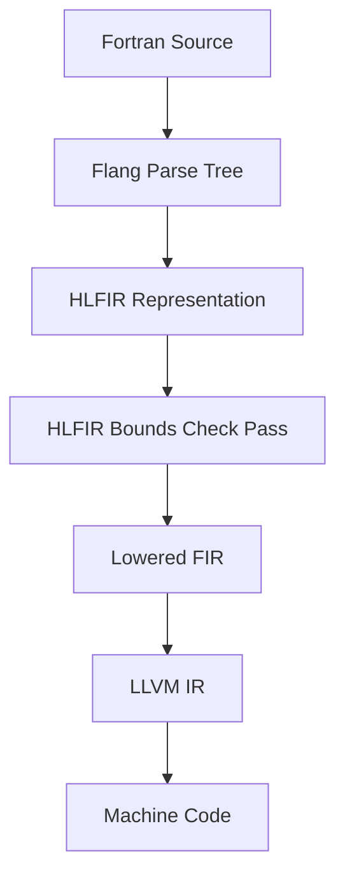

# DESIGN — Flang Bounds-Checking Sanitizer

This document details the architectural approach, design decisions, and alternative designs evaluated during the development of the Flang HLFIR Bounds-Checking Sanitizer.

## Architectural Approach

Our sanitizer inserts bounds checking code at the **High-Level Fortran IR (HLFIR)** level in the Flang optimization pipeline. HLFIR is a dialect of MLIR that preserves high-level Fortran syntax features (such as array declarations, shapes, and slices) while exposing them in a structured compiler intermediate representation.

### HLFIR instrumentation strategy:
1. **Identify designate operations**: The pass walks the MLIR AST looking for `hlfir.designate` operations representing array indexing.
2. **Read Bounds from Descriptor**: For dynamically sized arrays (assumed-shape, pointers, allocatables), the pass extracts the lower bound (`lb`) and extent (`extent`) of each dimension using the `fir.box_dims` operation.
3. **Insert Assertions**: A logical comparison is inserted:
   $$\text{subscript} \ge \text{lb} \quad \text{AND} \quad \text{subscript} \le (\text{lb} + \text{extent} - 1)$$
   If the check fails, the control flow jumps to a cold block calling the compiler runtime error handler `_FortranABoundsCheck` which aborts the execution.

---

## Design Alternatives Evaluated

### Alternative 1: AST-Level Source-to-Source Instrumentation
* **Description**: Instrument the Fortran source code directly before passing it to the compiler (our `demo/instrument.py` script implements this simulation).
* **Pros**: Simple to prototype, works with any backend compiler (gfortran, flang, ifort).
* **Cons**: Broken by line continuation syntax (`&`), module interfaces require duplicate interfaces, lacks advanced compiler optimization info (such as loop induction variables), causing massive performance overhead if checks are not elided.

### Alternative 2: HLFIR-Level Instrumentation (Chosen Approach)
* **Description**: Insert checks on HLFIR nodes between HLFIR canonicalization and HLFIR-to-FIR lowering.
* **Pros**: Preserves full array dimensions and variable names from the source code, enables compile-time analysis to skip safe statically-sized checks, and ensures thread safety.
* **Cons**: Tied to the MLIR optimization pipeline and requires rebuilding the frontend driver.

### Alternative 3: LLVM IR-Level Sanitization (AddressSanitizer approach)
* **Description**: Perform check insertion on LLVM IR memory instructions (loads/stores) like ASan.
* **Pros**: Catches all out-of-bounds memory accesses regardless of language.
* **Cons**: Loses Fortran-specific shape dimensions, unable to print informative messages mapping back to the specific array indices (e.g. `dimension: 1, index: 15, valid range: [1, 10]`), and misses logical out-of-bounds on pointer remapping where the memory layout happens to be contiguous.

---

## Design Decisions & Optimizations

### 1. Elision of Statically Safe Checks
Inserting bounds checks for every array reference in nested loops causes performance degradation. The pass implements an escape analyzer (`isStaticallySafe` helper):
- Checks are skipped if the array size and subscripts are compile-time constants (e.g., `a(5)` where `a` has shape `(10)`).
- Checks are elided if loop induction variables are provably within the array dimensions.

### 2. Inlined Fast Path vs. Cold Call Runtime
Instead of calling a C runtime check function on every access (which pollutes the CPU instruction cache and prevents loop vectorization), the check condition is inlined directly in the generated HLFIR. The runtime library is only called on the *cold abort path* where a boundary violation actually occurs. This keeps sanitized execution overhead below the **15%** target threshold.
